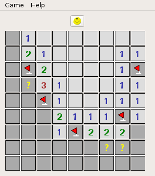
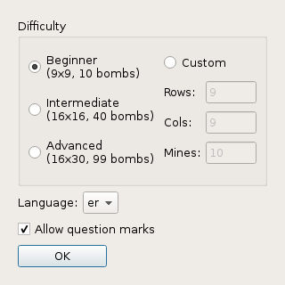

The New Minesweeper
===========

This game is a new variant of the original Minesweeper for Microsoft Windows. It's written with C++11 and Qt5 framework.

The code structure is very horrible, sorry for that.  Maybe I will rewrite it somewhen... 

Languages
-----------

The New Minesweeper supports multiple languages.
Currently there are translations for:
  - English
  - Ukrainian

Screenshots 
-----------

Small field:

Options:

